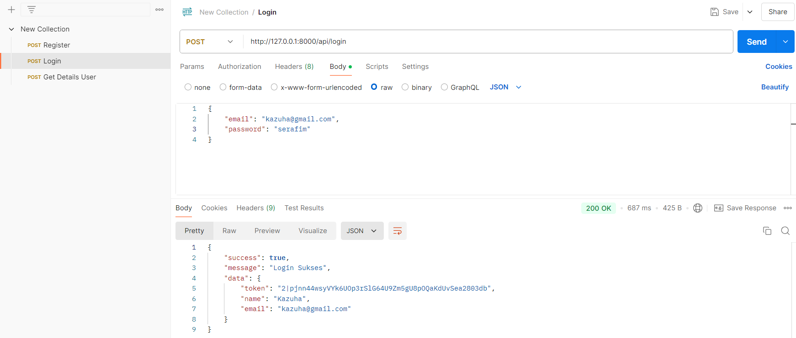
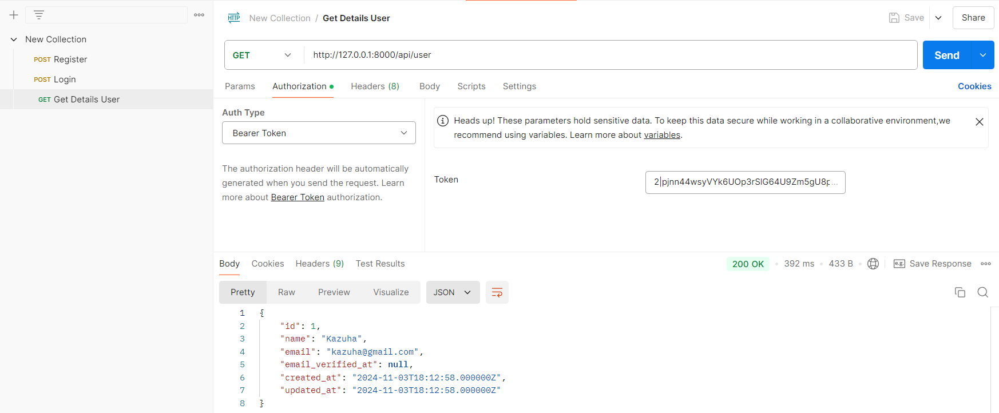

1. Apa yang dimaksud dengan Laravel Sanctum?

Laravel Sanctum adalah Sebuah paket autentikasi yang digunakan khusus untuk laravel. Tujuan utamanya yaitu menyediakan cara yang mudah dan aman untuk mengelola autentikasi dalam aplikasi laravel yang menggunakan API.

2. Bagaimana cara mengelola token autentikasi di Laravel?

Pertama kita membuat token, kedua kita menggunakan token, ketiga kita mengolah token tersebut.

3. Sebutkan langkah-langkah untuk menambahkan otorisasi berbasis peran dalam API!

a. Mendefinisikan peran dan izin 
b. Merelasikan antara user dan peran 
c. Menambahkan izin 
d. Middleware Otorisasi 
e. Menerapkan Middleware 
f. Menambahkan Paket Tambahan

Post Register

Post Login

Get Details User

